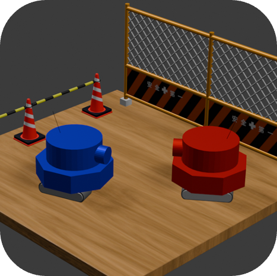

  

  <em>ARでプログラミングにリアリティを。</em>

  

**Scriptank**は, 自らプログラムを組んでAR戦車を操作し, リアル空間で対戦できる新感覚ARゲームです。  
複数人同時プレイや学習機能を備え, 遊びながら自然にプログラミング思考を身につけられます。  

## 🎮 主な特徴 / Features

### AR戦車バトル  
ARによる臨場感のある3D対戦を実現  

### スクリプトで戦車を制御
専用の言語で戦車の動作をプログラミング  
初心者でも直感的に使えるビジュアルエディタも搭載  
この機能については[こちらのページ](https://github.com/junya-tashiro/Scriptank/blob/main/dock/tol.md)にまとめています。  

### 複数人対戦対応
近くの友達とその場でバトル  

## 🔧 技術情報

詳しい技術構成や使用ライブラリなどは[こちらの技術解説ページ](https://github.com/junya-tashiro/Scriptank/blob/main/dock/tech.md)をご覧ください。  

## ⚠️ 注意事項

- 本リポジトリは **Scriptank の紹介およびデモ目的で公開**しており, ソースコードの一部は **セキュリティや著作権上の理由から非公開**としています。  
- 現在公開されている内容はあくまで **閲覧専用**であり, **そのままビルド・実行することはできません。**  
- コード等の無断転載・二次利用・再配布はお控えください。  

ライセンスについての詳細は [LICENSE](LICENSE) をご確認ください。  

  

