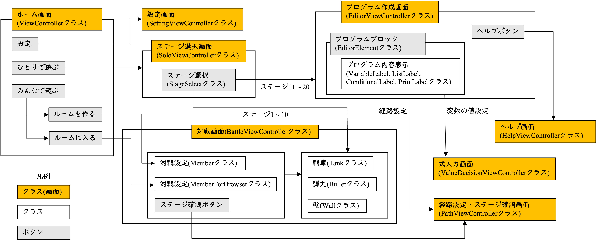
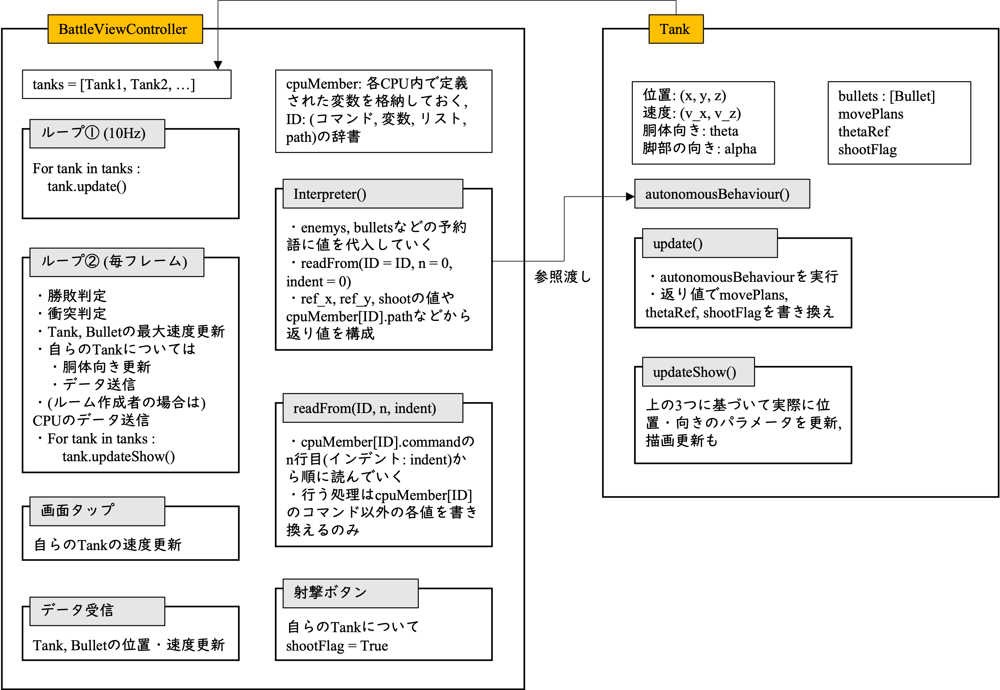

# Scriptank 技術解説

このページでは, Scriptank の開発背景・構成・使用技術・設計上の工夫点について詳しく紹介します。

<!-- @import "[
TOC
]" {cmd="toc" depthFrom=1 depthTo=6 orderedList=false} -->

<!-- @import "[TOC]" {cmd="toc" depthFrom=1 depthTo=6 orderedList=false} -->

<!-- code_chunk_output -->

- [Scriptank 技術解説](#scriptank-技術解説)
  - [1. 背景と目的](#1-背景と目的)
  - [2. 開発環境](#2-開発環境)
  - [3. ソースコード解説](#3-ソースコード解説)
    - [3.1. システム概略図](#31-システム概略図)
    - [3.2. BattleViewControllerにおける対戦処理](#32-battleviewcontrollerにおける対戦処理)
      - [3.2.1. 処理の構成とループの分離](#321-処理の構成とループの分離)
      - [3.2.2. 非同期処理によるパフォーマンス向上](#322-非同期処理によるパフォーマンス向上)
      - [3.2.3. autonomousBehaviourの構造と制限](#323-autonomousbehaviourの構造と制限)
  - [3.3. 複数人対戦における通信について](#33-複数人対戦における通信について)
      - [TANK](#tank)
      - [WALL](#wall)
      - [FNSH](#fnsh)
      - [MMBR](#mmbr)
      - [GOTO](#goto)
  - [3.4. コマンドの文法](#34-コマンドの文法)
    - [3.4.1. 特殊な型や構文](#341-特殊な型や構文)
    - [3.4.2. コマンド例（TOLコード）](#342-コマンド例tolコード)
  - [3.5. Interpreter関数の実行フロー](#35-interpreter関数の実行フロー)

<!-- /code_chunk_output -->


## 1. 背景と目的

Scriptankは, 私が卒業した東京大学工学部機械情報工学科において, 学部3年次秋学期の演習科目「自主プロ」にて開発した成果物です。  
「自主プロ」は, 当学科の中でも特徴的な演習の一つで, 講義やこれまでの演習で学んだ知識を活かし, 各自がメカトロニクスや知的情報処理を題材とした作品を約1ヶ月半(12月〜1月中旬)で制作・発表する取り組みです。その中で私は, モバイルアプリ「Scriptank」の開発に取り組みました。

本アプリは, かつて任天堂より発売されていた Wii ソフト「[はじめてのwii](https://www.nintendo.co.jp/wii/rhaj/index.html)」に収録されているゲーム「タンク!」から着想を得たものです。このゲームでは, 机の上に積み木で構成された簡易的なフィールド内でオモチャの戦車が砲弾を撃ち合って戦います。私はこのコンセプトを, AR技術を用いて現実世界で再現することができないかと考えたのが出発点です。  
Wii ソフトではテレビ画面の中の出来事でしかなかったミニチュア戦車の対戦を, AR を活用することでより没入感のあるリアルなユーザー体験へと昇華できるのではないかと考えました。  

また, 私が当時所属していた機械情報工学科（および現所属の知能機械情報学専攻）は, 主に知能ロボットを扱う分野であり, 実際にプログラムを記述してロボットを動作させる演習も行われていました。こうした中で私は, **プログラムの実行結果を目で見てリアルに体感できること**は, プログラミング学習における非常に大きなモチベーションになると感じていました。  
一方で, 実際のロボットは高価であり, 家庭や学校などで気軽に使用できる環境を整えるのは容易ではありません。そこで, 安価でありながらリアルな体験が得られるプログラミング学習の手段として AR に大きな可能性を感じました。  

Scriptank では, 単なる戦車バトルゲームにとどまらず, ユーザーがあらかじめプログラムを作成し, そのプログラムに従って戦車が自律的に行動し, 敵を倒しながらゴールを目指すという体験を通じて, 楽しくプログラミング学習ができるアプリケーションの実現を目指しました。  


## 2. 開発環境

| 項目 | 使用環境 |
|------|-----------|
| OS | macOS 15.4.1 |
| IDE | Xcode 16.3 |
| 3D編集ソフト | Blender 4.1.0 |
| 実機動作環境 | iOS 15.0 以降搭載のiPhone13Pro, iPhone8 |

- 使用言語: Swift
- 使用ライブラリ: 
  - **ARKit**: AR空間の構築と座標系管理
  - **SceneKit**: 3D戦車とステージの描画
  - **UIKit**: UI(エディタ、モード切替など)
  - **MultipeerConnectivity**: 複数デバイス間の通信(最大8人)


## 3. ソースコード解説
ソースコードの主要要素について説明します。

### 3.1. システム概略図
<p align="center">
  
  図1
</p>
「ひとりで遊ぶ」のステージ1-10がプレイヤーの操作により戦車を動かすステージ, ステージ11-20がプログラムより戦車を動かすステージになります。

### 3.2. BattleViewControllerにおける対戦処理
ここでは, `BattleViewController`クラスにおける対戦中の処理について解説します。  
まずは処理の概略について説明します。図2は対戦中の処理の全体的な流れを示しています。

<p align="center">
  
  図2
</p>

#### 3.2.1. 処理の構成とループの分離
各戦車は`Tank`クラスのインスタンスとして表現されており, `BattleViewControlle`r内では`tanks`というリストに格納されています。  
処理は主に2つのループを回すことで実現されています。

- ループ①（10Hz）
各戦車の内部パラメータを更新するループです。周期は約0.1秒で, 軽量な処理を定期的に実行します。

- ループ②（毎フレーム, 約60Hz）
勝敗判定, 衝突判定, TankおよびBulletの最大速度更新, 全Tankの描画更新, さらに自戦車に対する胴体の向き更新とデータ送信, ホスト端末におけるCPUデータの送信などを実行します。

このように処理を2種類に分けているのは, 自律的に動作する戦車（CPU）が存在することが関係しています。  
`Tank`クラスはインスタンス化の際に `autonomousBehavior`関数が`BattleViewController`から参照渡しされ, ループ①内でこの関数を実行することで内部パラメータを更新します。そして更新されたパラメータに基づき, ループ②で実際の行動が反映されます。

#### 3.2.2. 非同期処理によるパフォーマンス向上
`autonomousBehaviour`の実行には時間がかかる場合があるため, それによって全体の処理が停止し, 映像がカクついてしまうことが問題となります。これを防ぐため, 内部パラメータの更新（ループ①）と描画・動作の更新（ループ②）は非同期に処理されています。  
ただし, 非同期処理を採用してもループ②が常に60Hzで実行されるとは限らず, 処理負荷によって周期が遅くなることがあります。この場合, 戦車や弾丸の速度を「1フレームあたりの移動距離」として定義しているため, 見かけ上速度が低下するように見える場合があります。これは1人プレイでは大きな問題にはなりませんが, 複数人プレイでは同期のズレが目立つようになります。  
複数人プレイ時には, 各端末が定期的に戦車や弾丸の位置・速度情報を送受信し, 前回の受信データをもとに次の更新まで描画を続ける仕組みを取っています。  
しかし, 各端末の処理性能に差があるとループ②の周期も変わってしまい, 結果として「暫定更新による補間処理」にズレが生じます。たとえば, iPhone13Pro と iPhone8の間で対戦した際には, 映像に目立つカクつきが発生し, 快適なプレイを妨げました。  
この問題を解決するために, ループ②内では各端末でループ実行周期を計測し, 「単位時間あたりの最大移動量が一定になるように」速度を補正する処理を導入しました。これにより, ループ②の周期に依存せず, 見かけ上常に一定速度での動作が実現されています。  

#### 3.2.3. autonomousBehaviourの構造と制限
`autonomousBehaviour`関数の大きな特徴は以下の2点です：

1. `BattleViewController`から「参照渡し」された関数であり, `Tank`クラス内から `BattleViewController`のメンバ変数にアクセス可能であること  
2. 実行される`update`関数では戦車の特定の内部パラメータの書き換えのみを行うこと  

まず 1点目について説明します。図2に示すように, `autonomousBehaviour`は`Tank`クラスのインスタンス化時に`BattleViewController`から渡されるもので, 実態はTOL(戦車を操作する自作言語の呼称です)コードを解釈する `Interpreter`関数です（詳細は後述）。  
TOLでは変数やリストの宣言が可能であり, 変数名とその値を保存する仕組みとして`BattleViewController`内の`cpuMember`変数が用いられています。これはIDをキー, （コマンド, 変数辞書, リスト辞書, パス）のタプルを値とする辞書構造です。各戦車は固有の文字列IDを持っており, どの戦車の変数なのかを識別できます。
この実装によって`Tank`クラスから `BattleViewController`内の環境変数（たとえば敵戦車リスト`enemyies`や弾丸リスト `bullets`）にアクセス可能となり, TOLコードから周辺環境を取得しやすくなっています。  

2点目について, `autonomousBehaviour`を実行する`update`関数は, `Tank`クラスの`movePlans`（移動計画）, `thetaRef`（目標胴体角度）, `shootFlag`（発射フラグ）という3つのパラメータを`Interpreter`関数からの返り値で更新する処理のみを行っています。これらはその後ループ②内の`updateShow`関数で実際の位置・向き・弾丸発射などの描画更新に利用されます（図2を参照）。  
このように制限された構造を取っているのは, ユーザーによる不正操作（チート）を防ぐためです。たとえば, 弾丸連射速度や移動速度を意図的に操作されることがないように, TOLからアクセス可能なパラメータを厳密に制限しています。これにより,TOL言語と戦車制御ロジックの安全性と単純性が確保されています。

## 3.3. 複数人対戦における通信について

ここでは, `BattleViewController`の中でも, 特に複数人対戦における通信システムについて説明します。
通信機能の実装には, Apple社が提供する `MultipeerConnectivity`フレームワークを使用しました。このフレームワークは, Apple製端末間でファイル転送を行う「AirDrop」の仕組みにも利用されています。  
`MultipeerConnectivity`は, Wi-Fiや Bluetoothを利用して, 近接するiOS端末同士のP2P通信を実現するためのフレームワークです。各デバイスは`advertiser`か`browser`のいずれかに分かれ, `browser`が`advertiser`に対してメッセージ付きの接続要求を送信し, `advertiser`がそれを許可することで接続が確立されます。  

Scriptankにおいては, ルーム作成者が`advertiser`として振る舞い, ルーム参加者が`browser`となります。接続要求時には, 「ルーム名/デバイスの UUID/ユーザー名」という形式の文字列を送信します。  `advertiser`側は, 受信したルーム名が自身の設定したルーム名と一致する場合に接続を許可します。  

接続が確立された後は, 各デバイスが文字列を用いてさまざまな情報を相互に送受信します。情報の形式は, 基本的にスラッシュ/で区切られた文字列であり, 先頭4文字がメッセージの種類を示します。メッセージの種類としては, TANK, WALL, FNSH, MMBR, GOTOの5種類があります。以下では, それぞれのメッセージについて簡単に説明します。  

#### TANK
その名の通り, 戦車の状態を送信するメッセージです。  
具体的には, 以下の情報が含まれます：

- 戦車のID
- $x$座標, $z$座標
- $x$方向速度 $v_x$, $z$方向速度 $v_z$
- 脚部の角度 $\alpha$, 胴体の角度 $\theta$
- 放たれた弾丸の情報$(x, z, \theta)$
#### WALL
ステージ情報を送信するメッセージです。  
現時点ではステージは6種類のみのため, 番号を送信するだけでも成立しますが, 将来的にユーザーがカスタムステージを作成し, そのステージで対戦できるようにすることを見据え, より柔軟な構造で情報を送信する形式を採用しています。  

#### FNSH
対戦終了時に送受信されるメッセージです。どちらのチームが勝利したかなどの情報を含みます。

#### MMBR
対戦設定中のメンバー情報を送信するためのメッセージです。チームの変更が行われた場合や, ルームからメンバーが退出した場合などに使用されます。  
メッセージ内には, IDやユーザー名などが含まれます。  

#### GOTO
対戦中のフェーズ移行に使用されるメッセージです。例としては, 対戦画面への移行や, フィールドの設置処理などがあります。  
前述の4種類（TANK, WALL, FNSH, MMBR）に該当しない用途に使用されます。  

## 3.4. コマンドの文法
コマンドは「整数と文字列のタプルのリスト」という形式をとります。  
ここで, 整数はインデント（字下げ）を示し, 文字列は命令文を表します。インデントの働きはPythonと同様で, 条件分岐や繰り返し処理などの入れ子構造を表現するために使用されます。  

命令文は, 通常最初の1単語が命令の種類を示します。たとえば変数の宣言や更新を行う場合は, 以下のように記述します。

- 1単語目に型（`Bool`, `Int`, `Float`, `Tank`, `Bullet`など）
- 2単語目に変数名
- 3単語目以降で計算式を記述

計算式は「逆ポーランド記法（RPN）」で表現します。これは, 演算子を被演算子の後に置くことで, スタックを用いた簡単な評価が可能になるためです。  
また, 四則演算のように2項演算子だけでなく, 三角関数などの1項演算子にも対応しており, どちらも同様に後置記法で記述します。Bool型の演算も同様です。  

例：逆ポーランド記法での表現
- 通常の数式: `4.0 * (2.0 + 3.0) – sin(0.0)`
- TOLでの記述: `4.0 2.0 3.0 + * 0.0 sin –`

この計算結果を`var`という名前のFloat型変数に代入する場合は, 次のようなコマンドになります。  
```
Float var 4.0 2.0 3.0 + * 0.0 sin –
```
### 3.4.1. 特殊な型や構文
- Tank型/Bullet型：3単語目に変数名または初期値$(x, y, \theta)$を指定
- リスト型（`lBool`, `lInt`, `lFloat`, `lTank`, `lBullet`）：3単語目で処理を指定（`new`, `append`）、`append`の場合は4単語目に変数名を指定
  - 例：`lFloat my_list append var`
- 条件文（`if`, `while`）：
  - 例：`if t f ! &&`（Python の `if true and not false:` に相当）
- `for`文：
  - 例：`for var in lFloat my_list`
- `path`文：経路指定に使用
  - 例：`Path 2,1/0,0/-3,1`
- `print`文：
  - 例1：`print Float distance`
  - 例2：`print "Hello"`

### 3.4.2. コマンド例（TOLコード）
以下は, [こちらのページ](https://github.com/junya-tashiro/Scriptank/blob/main/dock/tol.md)で掲載したブロックをTOLコードに変換した例です。

```
(0, Int zero 0)
(0, if (Int count zero ==))
(1, path -1,1/0,-1/0,1/1,1/1,0)
(0, for enemy in lTank enemys)
(1, Float ref_x enemy:x)
(1, Float ref_y enemy:y)
(1, Float distance self:x enemy:x – self:x enemy:x - * self:y enemy:y – self:y enemy:y - * + sqrt)
(1, Float d 2.0)
(1, print Float distance)
(1, if (Float distance d <))
(2, Bool shoot t)
(0, Float distance 10.0)
(0, Bullet nearest 0.0 0.0 0.0)
(0, for bullet in lBullet bullets)
(1, Float x self:x bullet:x -)
(1, Float y self:y bullet:y -)
(1, Float d x x * y y * + sqrt)
(1, if (Float d distance <))
(2, Float e x bullet:theta sin * y bullet:theta cos * - abs)
(2, Float r 0.28)
(2, if (Float e r <))
(3, Bullet nearest bullet)
(3, Float distance d)
(0, Float r 6.0)
(0, Float r2 4.0)
(0, if (Float distance r <))
(1, Float x self:x nearest:x -)
(1, Float y self:y nearest:y -)
(1, Float a x x * y y * + 2 x nearest:theta cos * y nearest:theta sin * + * /)
(1, Float ref_x nearest:x a nearest:theta cos * +)
(1, Float ref_y nearest:y a nearest:theta sin * +)
(1, if (Float distance r2 <))
(2, Bool shoot t)
```

## 3.5. Interpreter関数の実行フロー
`Interpreter`関数の本体は, 概ね図2のフローに従って処理を行います。  
中心となるのは `readFrom`関数で, 引数として `ID`, `n`, `indent`を受け取ります。この関数はコマンドの`n`行目から順に読み取り, コマンドの末尾に到達するか, インデントが`indent - 1`になった時点で処理を終了します。なお, `if`文などの分岐構造を読んだ場合には, 条件に応じて`readFrom`自身を再帰的に呼び出す構造になっています。  

🧠 計算式の評価方法
TOLにおける計算式の評価は, スタックを用いた逆ポーランド記法で実現しています。  
以下に処理手順を示します。  

1. 式を左から順に読み, 被演算子であればスタックに積む
2. 演算子に到達したら, 必要な数だけスタックから取り出して計算
3. 計算結果をスタックに戻す
4. 式の終端でスタックのトップに残った値が評価結果
  
この方式により, 任意の深さ・構造の式でも簡潔かつ高速に評価できるように設計されています。
