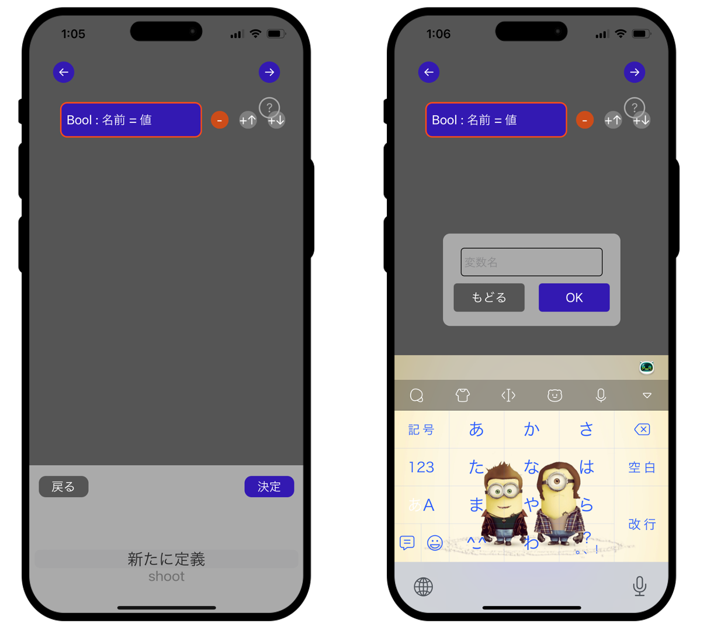

# 戦車プログラミング機能 解説

このページでは, 戦車プログラミング機能の使い方について説明します。実装面など技術的な内容は[こちらの技術解説ページ](https://github.com/junya-tashiro/Scriptank/blob/main/dock/tech.md)をご覧ください。

---

「ひとりで遊ぶ」モードの後半ステージでは, プレイヤーのボタン操作ではなく, 事前にブロックで組んだプログラムによって戦車を操ります。そのため, ステージ選択画面でステージを選択すると, 対戦画面は立ち上がらずに図1のようなプログラム作成画面が表示されます。

<p align="center">
  <br>
  図1 プログラム作成画面
</p>

戦車を操作するプログラムは, 開発時に「Tank Operating Language」の頭文字を取ってTOLと呼称していたため, 以下でもTOLと記述します。TOLによる戦車の操作方法は以下のとおりです。なお, この文章は図1右上のハテナマークから確認することもできます。

> **遊び方**  
>・このステージでは, ユーザーによる操作ではなくプログラムを組むことで戦車を動かします。  
>・対戦中, 戦車はここで作成したプログラムを繰り返し実行します。  
>**プログラムによる戦車の操作方法**  
>・Bool型変数「shoot」の値をtrueにすると, 戦車は攻撃を行います。  
>・小数型変数「ref_x」, 「ref_y」の値を変更することで, エイムするx座標,y座標を更新できます。  
>・「経路」から経路を設定することで, 戦車に移動計画を入力できま>す。  
>・一度設定された移動計画は完了または停止命令があるまで更新されません。  
>・整数型変数「count」は, 現在のターン数を表します。  
>・タンク型変数「self」は, 操作している自分自身の戦車を表します。  
>・タンク型リスト「enemies」は, フィールドに存在する敵戦車のリストです。  
>・弾丸型リスト「bullets」は, 自分以外の戦車が放ったすべての弾丸のリストです。  
>**プログラムブロックの仕様**  
>・変数, リストには「Bool型」, 「整数型」, 「小数型」, 「タンク型」, 「弾丸型」の5種類があります。  
>・タンク型変数はx,yの2つの値を, 弾丸型変数はx, y, θの3つの値を持ちます。  
>・リストには「初期化」および「末尾に要素を追加」の2つの操作が行えます。  
>・ifブロック: 条件がtrueのとき, 字下げされた処理を1回実行します。  
>・whileブロック: 条件がtrueの間, 字下げされた処理を繰り返し実行します。  
>・forブロック: リストの各要素を指定した変数に代入し, 処理を繰り返します。  

TOLの機能は大きく「変数」, 「リスト」, 「プリント文」, 「条件処理」, 「経路設定」の5つに分けられます。以下に, それぞれの機能について説明します。

#### 変数
図1の「変数の宣言・更新」ボタンを押すと, 図2左のように変数入力用エディタに切り替わります。変数には5種類の型があり, 宣言時には型を指定する必要があります。型を選択すると, 図2右のように「名前を選択」および「値を入力」ボタンが表示されます。

<p align="center">
  <br>
  図2 変数」を選択した後(左)と型を選択した後(右)
</p>

「名前を選択」を押すと図3左のように変数名の選択ビューが出現します。既存の変数を更新する場合は変数名を選択し, 新しく定義する場合は「新たに定義」を選び, 決定後に図3右の入力画面から名前を入力します。

<p align="center">
  <br>
  図3 変数名選択ビュー(左)と変数名入力ビュー(右)
</p>

「値を入力」ボタンを押すと, 型に応じて図4に示す計算式入力ビューが表示されます。ここでは, ()を含む複雑な式や, 変数, リスト, リストの長さなども扱うことが可能です。タンク型や弾丸型の各要素(x,yなど)は参照のみ可能で, 単体で書き換えることはできません。

<p align="center">
  <br>
  図4 計算式入力ビュー(左からBool型, 整数型, 小数型, タンク型, 弾丸型)
</p>

#### リスト

図1の「リストの宣言・更新」ボタンを押すと, 図5左のようにリスト型の選択ビューに切り替わります。型を選択すると図5右のように「名前を選択」, 「追加」, 「初期化」の3つのボタンが表示されます。

<p align="center">
  <br>
  図5 「リスト」を選択した後(左)と型を選択した後(右)
</p>

「追加」では定義済みの変数をリストに加えることができ, 「初期化」ではリストを新しく作成できます。

#### プリント文

図1の「プリント文」ボタンを押すと, 図6右のようなプリント文種類選択画面に遷移します。変数を選択した場合はその型の変数一覧が表示され, テキスト出力を選んだ場合は図3右と同様の入力ボックスが表示されます。実行時には, 図6左のように対戦ビュー上に出力されます。

<p align="center">
  <br>
  図6 プリント文の表示(左)と「プリント文」を選択した後(右)
</p>

#### 条件処理

図1の「if文・繰り返し」ボタンを押すと図7のように処理の種類を選ぶ画面に切り替わります。選択された構文（if,while,for）に応じて適切な条件入力ビューや型選択ビューが表示されます。

<p align="center">
  <br>
  図7 「if文・繰り返し」を選択した後
</p>

if文・while文は図4と同様の計算式入力ビューで条件を入力します。for文では, リストの型を選択し, 変数名とリスト名を順に指定することで繰り返し処理を作成できます。

#### 経路設定

図1の「経路」ボタンを押すと図8左のような経路計画画面が表示されます。ここで順番にマスをタップすると, 図8右のように経路順序が番号で表示され, 経路を設定できます。

<p align="center">
  <br>
  図8 経路計画設定ビュー(左)と経路入力後(右)
</p>

コード作成が完了したら, 図1右上の右矢印ボタンを押すことで対戦画面が起動します。対戦画面は基本的にプレイヤーが操作する際と同様ですが, ジョイスティックや攻撃ボタンの代わりにプリント文出力領域と「降参」ボタンが表示されます。

構文エラーがある場合, 実行時に該当部分は無視され, プリント領域にエラーメッセージが表示されます。コードはステージごとに保存されるため, 中断や再開も可能です。

TOLはブロックプログラミング言語として高い汎用性を持っています。以下に, 代表的な戦術行動を実現するコード例として, 次のような要件を満たすプログラムを考えます。

- ゴールへ向かう
- 近くに敵がいれば, その方向を向いて攻撃する
- 自分に向かってくる弾丸を検知し, 狙って撃ち落とす

3つ目の動作は単純に弾丸の方向を向くだけでは不十分であり, 弾速や方向を考慮した以下の計算が必要です。

---
自分の戦車の位置を$(x_{\mathrm{T}}, y_{\mathrm{T}})$, ある弾丸の位置を$(x_{\mathrm{B}}, y_{\mathrm{B}})$, 弾丸の向きを$\theta$(ただし, 角度は$x$軸を起点に反時計回りにとる)とする。この時, 弾丸が通る軌道の方程式は\[\sin\theta(x - x_{\mathrm{B}}) - \cos\theta(y - y_{\mathrm{B}}) = 0\]と表される。ここで, 戦車の半径を$r$とすると, この弾丸が戦車に衝突するためには, 「弾丸の軌道と戦車の距離が$r$より小さい」という条件が必要である。なお, 実際には戦車が弾の真後ろにいる場合のようにこの条件を満たしていながら衝突を起こさない場合もあるから十分条件ではない。この条件を書き下すと, 点と直線の距離の公式より\[\frac{|\sin\theta(x_{\mathrm{T}} - x_{\mathrm{B}}) - \cos\theta(y_{\mathrm{T}} - y_{\mathrm{B}})|}{\sqrt{\sin^2\theta+\cos^2\theta}}<r \\ 
\Leftrightarrow　|\sin\theta(x_{\mathrm{T}} - x_{\mathrm{B}}) - \cos\theta(y_{\mathrm{T}} - y_{\mathrm{B}})| < r\]となるから, 以下ではフィールド上に存在する弾丸のうちこの条件を満たすもののみを考慮に入れればよいことになる。さて, 自分が放つ弾丸とこの弾丸の速さが等しいとすれば, 弾丸どうしの衝突が起こるのは自分の戦車とこの弾丸の垂直二等分線上である。したがって砲台の向くべき方向は, この垂直二等分線と上で求めた弾丸の軌道の交点が存在する方向である。これを書き下すことで, 砲台の目標向きは\[\begin{cases}
\sin\theta(x_{\mathrm{ref}} - x_{\mathrm{B}}) - \cos\theta(y_{\mathrm{ref}} - y_{\mathrm{B}}) = 0 \\
(x_{\mathrm{ref}} - x_{\mathrm{T}})^2 + (y_{\mathrm{ref}} - y_{\mathrm{T}})^2 = (x_{\mathrm{ref}} - x_{\mathrm{B}})^2 + (y_{\mathrm{ref}} - y_{\mathrm{B}})^2
\end{cases} \\ 
\Leftrightarrow \begin{cases}
x_{\mathrm{ref}} = x_{\mathrm{B}} + \frac{(x_{\mathrm{T}} - x_{\mathrm{B}})^2 + (y_{\mathrm{T}} - y_{\mathrm{B}})^2}{2 \{ \cos\theta(x_{\mathrm{T}} - x_{\mathrm{B}}) - \sin\theta(y_{\mathrm{T}} + y_{\mathrm{B}}) \}}\cos\theta \\
y_{\mathrm{ref}} = y_{\mathrm{B}} + \frac{(x_{\mathrm{T}} - x_{\mathrm{B}})^2 + (y_{\mathrm{T}} - y_{\mathrm{B}})^2}{2 \{ \cos\theta(x_{\mathrm{T}} - x_{\mathrm{B}}) - \sin\theta(y_{\mathrm{T}} + y_{\mathrm{B}}) \}}\sin\theta
\end{cases}
\]より求められる。

---
以上の処理を反映したコードの具体例を, 図9に示します。

<p align="center">
  <br>
  図9 作成したコード(図は複数画像を合成して作成)
</p>

なお, このコードをPythonで擬似的に表現すると以下のようになります。

```Python
zero = 0
if count == zero:
    path = '-1,-1/0,-1/0,1/1,1/1,0' # 最初に経路を設定

# 敵が一定以上近くにいたらそちらに照準を合わせ, 弾丸発射フラグを立てる
for enemy in enemies:
    ref_x = enemy.x
    ref_y = enemy.y
    distance = sqrt((self.x - enemy.x) ** 2 + (self.y - enemy.y) ** 2)
    d = 2.0
    print(distance)
    if distance < d:
        shoot = True

distance = 10.0
nearest = (0.0, 0.0, 0.0)

# 自分に向かってきている弾丸のうち, 最も距離が近いものを計算
for bullet in bullets:
    x = self.x - bullet.x
    y = self.y - bullet.y
    d = sqrt(x ** 2 + y ** 2)
    if d < distance:
        e = abs(x * sin(bullet.theta) - y * cos(bullet.theta))
        r = 0.28
        if e < r:
            nearest = bullet
            distance = d

# 上で求めた弾丸が一定距離より近くにあればそちらを向き, 更に一定距離より近くにあれば弾丸発射フラグを立てる
r = 6.0
r2 = 4.0
if distance < r:
    x = self.x - nearest.x
    y = self.y - nearest.y
    a = (x ** 2 + y ** 2) / (2 * (x * cos(nearest.theta) + y * sin(nearest.theta)))
    ref_x = nearest.x + a * cos(nearest.theta)
    ref_y = nearest.y + a * sin(nearest.theta)
    if distanec < r2:
        shoot = True
```